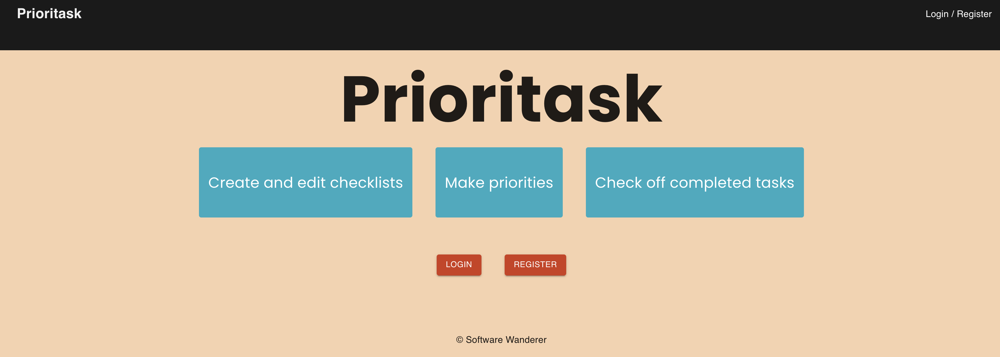

# Prioritask

## Try it out
[Prioritask website](https://prioirtask-3d02e9c6acd9.herokuapp.com/)

## Overview

Prioritask is a solo project aimed at solving the problem of streamlining to-do lists and task management. The project offers a web application that focuses on helping users manage their top priorities efficiently.

## Problem

Managing tasks and to-do lists can become overwhelming, especially when dealing with a large number of tasks spread across various projects or categories. Traditional to-do list apps often lack the ability to prioritize tasks effectively, making it challenging for users to focus on what truly matters.

## Solution

Prioritask provides a solution by offering a task management web application that emphasizes top priorities. The app allows users to create up to four checklists, each with a limited number of tasks and deadlines. By setting clear priorities and deadlines, users can stay focused on what's most important and avoid getting overwhelmed by a long list of tasks.

## Key Features

- **Multiple Checklists**: Users can create up to four checklists, each dedicated to a specific project, category, or area of life.

- **Task Prioritization**: Within each checklist, users can prioritize tasks to ensure they focus on what matters most.

- **Task Deadline**: Users can set deadlines for tasks, helping them stay organized and meet their goals.

- **User-Friendly Interface**: The app features an intuitive and user-friendly interface for easy task management.

- **Collaborative UI/UX Design**: The project involved collaboration on UI/UX design to ensure a visually appealing and user-friendly experience.

- **Deployment**: Prioritask is successfully deployed on Heroku, making it accessible to users online.

### Sign-In Page

- **Register or login**

### Checklist Page

- **Create and manage checklists**

### Other Page Features

- **Manage priorities**
- **Set tasks**
- **Create deadlines**

## Tech Stack

- **Frontend**:
  - HTML, CSS
  - JavaScript
  - React.js
  - Material UI

- **Backend**:
  - Node.js
  - Express.js
  - PostgreSQL

- **Other Tools**:
  - Git for version control
  - Adobe Suite for design
  - Figma for UI/UX design

## Getting Started

To set up Prioritask locally for development or testing, follow these steps:

1. Clone the repository to your local machine.
2. Ensure you have the necessary prerequisites installed:
   - Node.js
   - PostgreSQL
   - Nodemon
3. Create a PostgreSQL database for the project.
4. Configure the `.env` file with the necessary environment variables, including the `SERVER_SESSION_SECRET` for security.
5. Run `npm install` to install project dependencies.
6. Start the development server by running `npm run server`.
7. Start the client-side application by running `npm run client`.
8. Access Prioritask in your web browser at `http://localhost:3000`.

## Project Structure

The project directory structure is organized as follows:

- `src/`: Contains the React application code.
- `public/`: Contains static assets for the client-side.
- `server/`: Contains the Express App for the backend.
